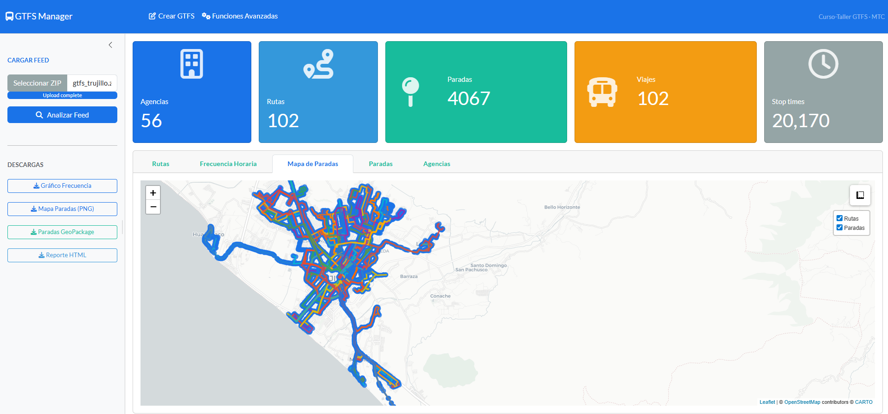

# GTFS Manager

A Shiny web application for analyzing, creating, and validating GTFS (General Transit Feed Specification) feeds. Developed for the **Curso-Taller GTFS**.



## Features

The app is organized into three main tabs:

### 1. Análisis GTFS

Upload an existing GTFS ZIP feed and get:

- Summary metrics: agencies, routes, stops, trips, and stop times
- Interactive stop map (Leaflet)
- Hourly service frequency chart
- Browsable tables for routes, stops, and agencies
- **Downloads:** frequency chart (PNG), stops map (PNG), stops as GeoPackage, HTML report

### 2. Crear GTFS

Build a complete GTFS feed from scratch through a guided form:

- **Agency** – name, timezone, currency, language, phone
- **Stops** – editable table; upload from CSV or use default Trujillo stops; add/remove rows
- **Routes** – route ID, short/long names, type, colors
- **Calendar** – weekday and weekend service windows, frequency, and validity period
- **Fares** – adult, student, and senior fares with payment method
- **Trips & Schedules** – preview of generated `trips.txt` and `stop_times.txt`
- **Downloads:** full GTFS ZIP, individual `trips.txt` and `stop_times.txt`

### 3. Funciones Avanzadas

Load a GTFS feed for deeper analysis:

- **Feed validation** – checks referential integrity (routes with trips, stops used in stop_times, geographic bounding box for Peru)
- **Frequency analysis** – hourly trip counts chart
- **Downloads:** stops as GeoPackage, routes/shapes as GeoPackage, HTML report

## Requirements

- R (>= 4.1)
- The following R packages:

```r
install.packages(c(
  "shiny",
  "bslib",
  "DT",
  "leaflet",
  "tidytransit",
  "gtfstools",
  "sf",
  "ggplot2",
  "dplyr",
  "readr",
  "purrr",
  "zip"
))
```

> **Note:** `sf` requires system-level GDAL/GEOS libraries. On Windows, these are bundled automatically via the binary package. On Linux/macOS, install them with your system package manager before running `install.packages("sf")`.

## Live Demo

The app is deployed and available on Posit Cloud:

**[https://019da23e-461a-53da-8670-96031dc3a120.share.connect.posit.cloud/](https://019da23e-461a-53da-8670-96031dc3a120.share.connect.posit.cloud/)**

## Running the App Locally

```r
shiny::runApp("app.R")
```

Or from the terminal:

```bash
Rscript -e "shiny::runApp('app.R')"
```

## Sample Data

A sample GTFS feed is included in the `feeds/` folder:

| File                                  | Description                                    |
| ------------------------------------- | ---------------------------------------------- |
| `feeds/gdeda-aguascalientes-mx.zip` | Public transit feed for Aguascalientes, Mexico |

Use this file to explore the **Análisis GTFS** and **Funciones Avanzadas** tabs without needing your own data.

## CSV Template for Stops

When building a feed in the **Crear GTFS** tab, you can upload a CSV file for stops. The file must contain at least:

| Column        | Description                        |
| ------------- | ---------------------------------- |
| `stop_name` | Name of the stop                   |
| `stop_lat`  | Latitude (decimal degrees, WGS84)  |
| `stop_lon`  | Longitude (decimal degrees, WGS84) |

Optional columns: `stop_id`, `stop_code`. These are auto-generated if not provided.

Download a pre-filled template directly from the app (Paradas tab → **Plantilla CSV**).

## Project Structure

```
GTFS_Manager/
├── app.R        # Single-file Shiny app (UI + server + helper functions)
└── feeds/       # Sample GTFS feeds for testing
```

## License

This project was developed as part of the **Curso-Taller GTFS**
